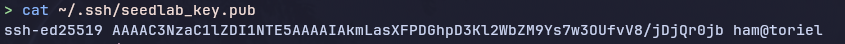
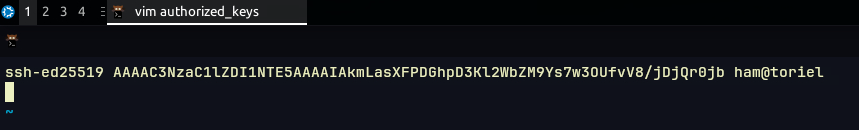

# How to add your SSH key to the seedlab server

## Initial setup (local machine)

On your **local machine** first create the ```.ssh``` directory if it does not exist.

### Linux/MacOS

```bash
# Create .ssh directory
mkdir -p ~/.ssh
# And restrict the permissions so only your user has access
chmod 700 ~/.ssh
```

### Windows (use powershell):
```powershell
if (!(Test-Path ~/.ssh)) { mkdir ~/.ssh }
```


## Generating a key pair

Now we can generate a keypair to use with the server.

```bash
ssh-keygen -t ed25519 -f ~/.ssh/seedlab_key
```

When prompted to set a password, you can either hit enter to allow for ssh without a password or you can set a password if desired. 

This should generate two files: ```seedlab_key``` (your private key) and ```seedlab_key.pub``` (your public key)

Now update the permissions on your private key (Linux/MacOS):

```bash
chmod 600 ~/.ssh/seedlab_key
```

Now print out the contents of ```seedlab_key.pub``` that is your public key and what you will be adding to the server.

### Linux/MacOS:
```bash
cat ~/.ssh/seedlab_key.pub
```

### Windows:
```powershell
Get-Content ~/.ssh/seedlab_key.pub
```



## Adding your public key to the server

Now log into the server as normal (via VNC) and open a terminal.
Now we will create a ```.ssh``` directory on the server if it does not exist and then correct the permissions like we did earlier.

```bash
# Create the directory if it doesn't exist
mkdir -p ~/.ssh

# And restrict the permissions so only your user has access
chmod 700 ~/.ssh
```

Now create and edit the ```authorized_keys``` file in your favorite editor and paste in your public key.

```bash
nano ~/.ssh/authorized_keys
```



Now save the file and you have added your key to the server.

## Editing your SSH config to use your key

Now go back to your own **local machine** and edit the ```~/.ssh/config``` file.


### Linux/MacOS

```bash
nano ~/.ssh/config
```

### Windows
```powershell
notepad ~/.ssh/config
```

Now paste the following in:

```
Host seedlab
    Hostname <The IP of the server>
    User seed
    IdentityFile ~/.ssh/seedlab_key
```

Remember to change the ip address to the actual IP address of the server.

Save the file and now you should be able to run this command to connect to the server

```bash
ssh seedlab
```